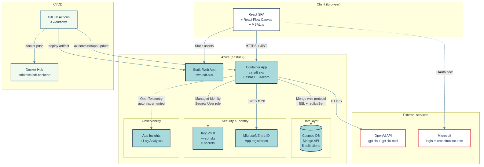

# System Design Teacher

> A web platform for practicing system-design interviews. Drag components onto a canvas, submit your architecture, and get structured AI feedback in seconds.

**Live demo**: https://zealous-cliff-07bce210f.7.azurestaticapps.net


---

## What it does

Two practice modes:

1. **Situation practice** — Read a real-world scenario question (50 curated, with reference answers pre-generated by GPT-4o). Filter by category and difficulty. Reveal the answer when ready.
2. **Design canvas** — Drag and drop architecture components (load balancer, cache, queue, database, microservice, and 10 more), connect them, optionally label each edge, and submit. An LLM returns severity-graded feedback with affected components highlighted on your diagram.

Every submission is rate-limited (2 design submissions per user per day, 5 situation fetches), cached by a normalized hash of the diagram structure, and persisted to a history page for re-review.

## Why I built it

Portfolio project that demonstrates four things:

- **Cloud-native architecture** on Azure: Container Apps, Cosmos DB (Mongo API), Key Vault with Managed Identity, Static Web Apps, App Insights, all provisioned by Bicep
- **Clean code architecture**: hexagonal / ports-and-adapters, with dependency injection
- **Practical LLM integration**: structured outputs validated by Pydantic, retry-on-schema-failure, cache-first design to manage cost
- **End-to-end production engineering**: CI/CD on every push to `main`, automated deploys to two Azure resources, monitoring, budget alerts, hard cost cap

It also happens to be a tool I actually use to study for senior-engineer system-design rounds.

## Architecture



In one paragraph: a React SPA on Azure Static Web Apps talks to a FastAPI backend on Azure Container Apps. Microsoft Entra ID handles sign-in. Cosmos DB stores users, questions, attempts, and feedback cache. Key Vault holds secrets, accessed by the Container App's Managed Identity. OpenAI's API generates design feedback. Application Insights collects telemetry. Bicep provisions everything; GitHub Actions deploys on every push.

For depth: [`docs/ARCHITECTURE.md`](./docs/ARCHITECTURE.md). For why-we-chose-X reasoning: [`docs/adr/`](./docs/adr/).

## Tech stack

| Layer                 | Choice                                         | Why                                                  |
| --------------------- | ---------------------------------------------- | ---------------------------------------------------- |
| Frontend framework    | React 18 + Vite                                | Fast dev loop, mainstream                            |
| Frontend language     | TypeScript (strict)                            | Type safety, portfolio signal                        |
| Frontend state        | TanStack Query (server) + Zustand (client)     | Right tool per state type                            |
| Diagram canvas        | React Flow (`@xyflow/react`)                   | Purpose-built for this                               |
| Frontend styling      | Tailwind CSS                                   | No CSS sprawl                                        |
| Auth                  | MSAL.js + Microsoft Entra ID                   | Tenant-trusted login                                 |
| Backend language      | Python 3.12                                    | Strong LLM ecosystem                                 |
| Backend framework     | FastAPI + uvicorn                              | Async, auto OpenAPI, Pydantic                        |
| Backend DI            | dependency-injector                            | Declarative, environment-driven                      |
| Database              | MongoDB 7 (local) / Cosmos DB Mongo API (prod) | Same wire protocol; one adapter works for both       |
| Cache (LLM responses) | Cosmos collection with TTL                     | No separate Redis needed in production               |
| LLM                   | OpenAI API (gpt-4o, gpt-4o-mini)               | Best structured output quality                       |
| Telemetry             | structlog (local) / App Insights (prod)        | OpenTelemetry-based                                  |
| Secrets (prod)        | Azure Key Vault + Managed Identity             | No secrets in env vars                               |
| Infrastructure        | Bicep                                          | Declarative, idempotent, Azure-native                |
| CI/CD                 | GitHub Actions                                 | Three workflows: CI, backend deploy, frontend deploy |
| Local orchestration   | Docker Compose                                 | Single command brings up the stack                   |

## Local quickstart

Five minutes from clone to running locally:

```bash
git clone https://github.com/sarthakdixit/system-design-teacher.git
cd system-design-teacher

# Copy env template, then fill in OPENAI_API_KEY
cp backend/.env.example backend/.env.local
$EDITOR backend/.env.local   # set OPENAI_API_KEY

# Bring up backend, MongoDB, Mongo Express, Redis
docker compose up -d

# Seed the database (one-time)
cd backend
docker compose exec backend python scripts/seed_questions.py
docker compose exec backend python scripts/seed_design_questions.py

# Frontend
cd ../frontend
npm install
npm run dev
```

Open `http://localhost:5173`. Sign-in is mocked locally (`VITE_AUTH_MODE=mock`), so you don't need a Microsoft tenant to develop.

Backend API docs at `http://localhost:8000/docs`. Mongo browser at `http://localhost:8081`.

## Cost

Steady-state Azure cost: **~$0/month** on free tiers. The cap is enforced at $5/month via a budget alert.

| Resource                         | Free tier                      | Status             |
| -------------------------------- | ------------------------------ | ------------------ |
| Cosmos DB (Mongo API)            | 1000 RU/s + 25 GB storage      | within limits      |
| Container App (Consumption plan) | 180k vCPU-sec + 360k GB-sec/mo | scales to zero     |
| Static Web App (Free SKU)        | 100 GB bandwidth/mo            | within limits      |
| Key Vault                        | 10k transactions/mo            | well under         |
| Log Analytics + App Insights     | 5 GB/mo logs                   | capped at 1 GB/day |

OpenAI API costs are separate and metered per submission:

- **Design feedback**: ~$0.05–$0.15 per submission (gpt-4o, ~3000 tokens)
- **Reference answers**: ~$0.50 one-time (50 questions × gpt-4o, generated at seed time)
- **Cached submissions**: $0 (Cosmos cache hit)

A user submitting the same diagram twice pays once. Two users submitting structurally identical diagrams (sorted nodes/edges, normalized labels) share the cache.

## Project structure

```
system-design-teacher/
├── backend/                    # FastAPI app, hexagonal architecture
│   ├── app/
│   │   ├── core/               # Pure business logic (no I/O)
│   │   │   ├── domain/         # Entities, errors
│   │   │   ├── ports/          # Abstract interfaces
│   │   │   └── services/       # Use cases
│   │   ├── adapters/           # I/O implementations
│   │   │   ├── local/          # MongoDB, Redis, mock auth
│   │   │   └── azure/          # Cosmos, Entra, Key Vault, App Insights
│   │   ├── api/                # FastAPI routes + schemas
│   │   ├── config/             # Settings, DI container
│   │   └── main.py
│   ├── scripts/                # Seed data, generate reference answers
│   └── tests/
├── frontend/                   # React 18 + Vite SPA
│   └── src/
│       ├── features/           # Feature-sliced (auth, situation, canvas, history)
│       ├── shared/             # Cross-feature components, hooks
│       ├── app/                # Router, providers, layout
│       └── config/             # Env, MSAL config
├── infra/                      # Bicep IaC
│   ├── main.bicep
│   └── modules/                # cosmos, keyvault, insights, containerapps, staticwebapp
├── docs/
│   ├── DESIGN.md               # Detailed architecture spec
│   ├── ARCHITECTURE.md         # Short narrative companion
│   ├── DEPLOYMENT.md           # Azure deployment runbook
│   ├── DEMO_SCRIPT.md          # 2-min walkthrough script
│   ├── diagrams/               # Mermaid + rendered PNG
│   └── adr/                    # 8 ADRs documenting key decisions
├── .github/workflows/          # CI, deploy backend, deploy frontend
├── AGENT.md                    # Conventions for AI assistants and contributors
└── docker-compose.yml
```

## Status & roadmap

| Batch | Goal                                                         | Status             |
| ----- | ------------------------------------------------------------ | ------------------ |
| 1     | Foundation: ports, adapters, DI, health endpoint             | ✅ Done            |
| 2     | Auth: MSAL + JWT, mock auth for local                        | ✅ Done            |
| 3     | Situation practice mode + 50 seeded questions                | ✅ Done            |
| 4     | Design canvas + AI feedback (the headline feature)           | ✅ Done            |
| 5     | Azure migration + CI/CD                                      | ✅ Done            |
| **6** | **Polish: README, edge labels, history, tests**              | **🚧 In progress** |
| 7+    | Custom domain, frontend Lighthouse-in-CI, IaC for monitoring | future             |

Architecture-relevant decisions are captured as ADRs in [`docs/adr/`](./docs/adr/):

1. [ADR-001](./docs/adr/001-ports-and-adapters.md) — Hexagonal architecture
2. [ADR-002](./docs/adr/002-cosmos-mongo-api.md) — Cosmos Mongo API over native NoSQL
3. [ADR-003](./docs/adr/003-direct-openai.md) — Direct OpenAI over Azure OpenAI
4. [ADR-004](./docs/adr/004-rate-limiting.md) — Two-layer rate limiting
5. [ADR-005](./docs/adr/005-json-over-image.md) — JSON over image for diagram submission
6. [ADR-006](./docs/adr/006-dependency-injector.md) — `dependency-injector` library
7. [ADR-007](./docs/adr/007-docker-compose.md) — Docker Compose for local dev
8. [ADR-008](./docs/adr/008-edge-labels.md) — Edge labels on the design canvas

## Contributing

For development conventions (naming, architecture rules, what AI assistants get wrong here), read [`AGENT.md`](./AGENT.md) and [`AGENT-frontend.md`](./AGENT-frontend.md).

For deploying to Azure: [`docs/DEPLOYMENT.md`](./docs/DEPLOYMENT.md).

## License

MIT — see [LICENSE](./LICENSE).

---

<sub>Built by [Sarthak Dixit](https://github.com/sarthakdixit). Questions? Open an issue or hit me on GitHub.</sub>
